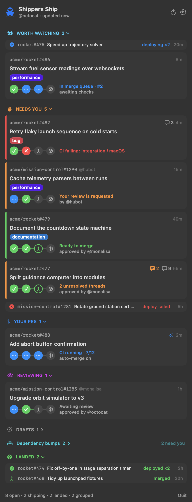

# Shippers Ship ⛴

A macOS menu bar app for the last mile of GitHub pull requests: **review → CI → merge queue → deploy**.



Shippers Ship watches the PRs you **wrote**, the ones **waiting on your review** (or that you've already reviewed), and recently **merged** PRs you wrote, reviewed or merged, so you can watch them deploy. Each PR gets a four-stage pipeline and a single line saying what's holding it up: failing checks (by name), changes requested, merge conflicts, unresolved review threads, merge-queue position, auto-merge, or deploy status per environment.

The panel is sorted by urgency:

- **Worth watching 👀**: PRs shipping right now. Deploys in progress (or queued) come first, then PRs in the merge queue by position, then PRs that are **live** in an environment, newest first. Nothing to do but keep an eye on them.
- **Needs you**: anything waiting on *you*: failing CI, changes requested, conflicts, unresolved threads, review requests, PRs ready to merge, failed deploys. The menu bar icon shows how many.
- **Your PRs**, **Reviewing**, **Drafts**: everything else that's open.
- Your **groups** (see below).
- **Landed**: recently merged PRs, one line each, with their deploy status.

## Install

Download the latest `ShippersShip-*.zip` from [Releases](https://github.com/urcomputeringpal/shippersship/releases), unzip it, and move **Shippers Ship.app** to `/Applications`. Each release includes a `.sha256` checksum (`shasum -a 256 -c ShippersShip-*.zip.sha256`). Release builds are ad-hoc signed and not notarized, so the first time you open one, right-click the app → **Open** (or run `xattr -dr com.apple.quarantine "/Applications/Shippers Ship.app"`).

Or build it yourself. You'll need macOS 14+ and Xcode 16+:

```bash
./scripts/build-app.sh --install
```

## Sign in

Shippers Ship uses the first GitHub token it finds:

1. `$GITHUB_TOKEN`
2. A token pasted into Settings (stored in your Keychain)
3. The [GitHub CLI](https://cli.github.com)'s login (`gh auth token`)

If you already use `gh`, there's nothing to set up. Adding and removing labels needs a token with write access to the repo.

## Keyboard

| Key | In the list | In the label picker |
| --- | --- | --- |
| **↑ ↓** | Move between section headers and PRs | Move between labels |
| **← →** | Collapse / expand the current section | |
| **⌥← ⌥→** | Collapse / expand every section | |
| **⏎** | Open the PR, or toggle a section header | Add / remove the label |
| **Space** | Toggle a section header | |
| **L** | Open the label picker for the selected PR | |
| **esc** | Clear the selection | Close |
| **⌘R** | Refresh | |

## Right-click menu

Right-click a PR to open it or its checks, jump to a failing check or deployment, copy its link, edit labels, or move it to a group. On your own open PRs, you can also **Convert to Draft** or **Mark Ready for Review** (not available while a PR is in the merge queue).

## Labels

Select a PR and press **L** (or right-click → **Labels…**). Labels already on the PR are listed first. Type to fuzzy-filter (`dprod` finds `deploy:production`), then press **⏎** to add or remove the highlighted one. The filter clears after each change so you can go straight to the next label.

## Groups

Groups pull matching PRs out of the regular sections into their own collapsible section. Use them to fence off dependency bumps, a noisy repo, or anything else you only want to check now and then. Create them in **Settings → Groups**, or right-click a PR → **Move to Group**.

- A group has one or more **rules**. A PR joins the **first** group with a rule that matches it.
- **Quiet** groups (the default) don't count toward the menu bar badge and don't send notifications. A collapsed group still shows how many of its PRs need you.

Rules are written like GitHub searches, and every term in a rule must match:

```
repo:acme/web-*                     # glob on owner/name (or just the name: repo:web)
org:acme
author:dependabot label:dependencies
is:review-requested author:github-actions
"bump version" -label:urgent        # bare words/phrases match the title; a leading - negates
```

Qualifiers: `repo:` `org:` `author:` `label:` `title:` `is:draft|open|merged|authored|review-requested|reviewed`. Matching ignores case, and `*`/`?` work as wildcards.

## Settings

Refresh interval, how far back to show landed PRs, hiding open PRs with no recent activity, notifications, launch at login, and the GitHub token.

## Notes

- **Live** means the PR's commit is the newest successful deployment in that environment. GitHub's own `ACTIVE` deployment state isn't used, because many deploy tools never mark older deployments inactive. Live PRs get a **LIVE** badge; if one also needs you (failing CI, say), it stays in Needs you.
- **Deployments** come from GitHub's Deployments API (deployments of the merge commit, plus "deployed" events on the PR). Repos that deploy some other way show the Deploy stage as n/a.
- Shippers Ship runs four GitHub searches per refresh (authored, review-requested, reviewed, recently merged), 25 results each. Batching them into one query tends to time out.

## Development

```bash
swift build
swift test                                      # filters, status logic, fuzzy matching, decoding
SHIPPERS_SHIP_LIVE=1 swift test                 # also prints a live snapshot of your PRs
.build/debug/ShippersShip --keytest [dir]       # drives the UI with real key events against demo data
.build/debug/ShippersShip --snapshot out.png --demo   # renders the panel (this is how docs/screenshot.png is made)
```

The code is split in two:

- `Sources/ShipKit`: models, the GitHub GraphQL client, status/pipeline logic, filters and groups, and fuzzy matching. It has no UI and is covered by `swift test`.
- `Sources/ShippersShip`: the SwiftUI menu bar app.

See [CONTRIBUTING.md](CONTRIBUTING.md) and [SECURITY.md](SECURITY.md). `--keytest` and `--snapshot` exist only in debug builds.

## License

[MIT](LICENSE)
